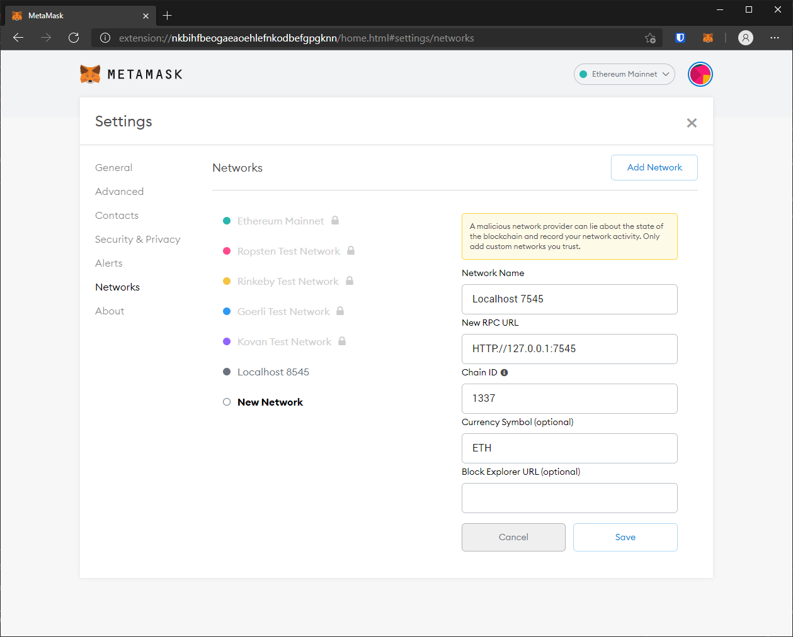

# Security in Computing and IT
## Assignment 2 Blockchain

Created using Ethereum, Solidity and React. By Justin Naismith - s3605206

Based on tutorial from [Dapp University.](https://youtu.be/VH9Q2lf2mNo)

Base code created using [Create React App.](https://create-react-app.dev/docs/adding-typescript/) Additional code from [Dapp University.](https://github.com/dappuniversity/starter_kit)

## Run Steps
1. Install [Node](https://nodejs.org/en/) if not already installed (`node -v` in terminal to check).
2. `npm i` in terminal to install node modules.
3. Download and run [Ganache.](https://www.trufflesuite.com/ganache)
2. Install [Metamask](https://metamask.io/download.html) extension. 
3. [Add accounts](https://youtu.be/VH9Q2lf2mNo?t=5222) from Ganache to Metamask.
4. Create test network 7545 
4. Create a new workspace. Name it **marketplace.**
5. Press **Add Project** and select the `truffle-config.js` file, then **save workspace.**
6. 

Maybe install truffle?

npm i
